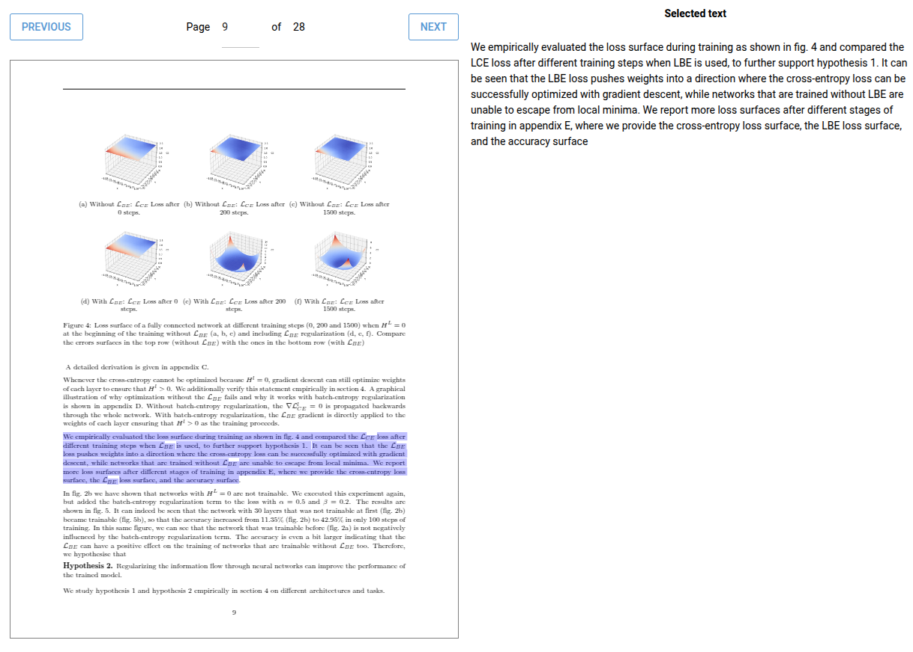

# nicegui-pdf
A PDF component (using pdf.js) to nicely integrate PDFs into nicegui using bindings.
This makes it easy to open a specific page or to get the content that is currently selected.
- page_number
- num_pages
- is_rendering
- selected text

## ToDo's
- [x] Basic viewer
- [x] Text Overlay
- [x] Binding of pages etc
- [x] Binding of selected text
- [x] Support resizing
- [ ] Binding on path
- [ ] Highlight text (not 100% sure yet)
- [ ] Push to pypi
